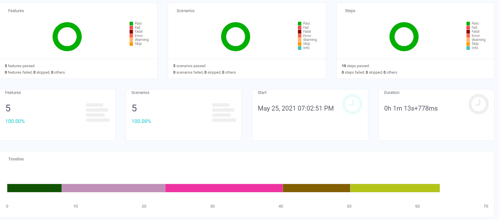
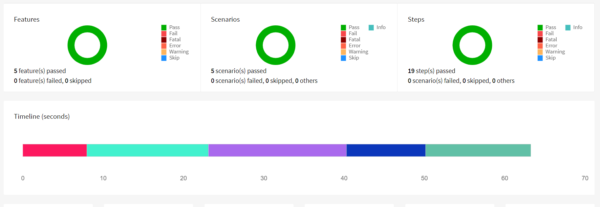
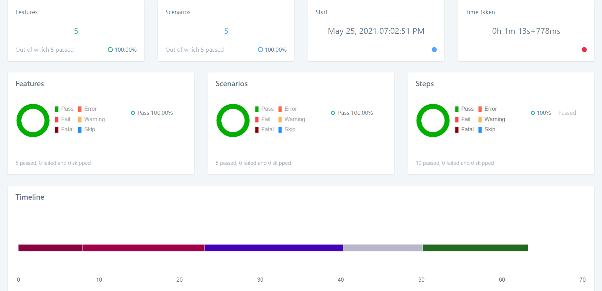

Wolters Kluwer - Todos list Assignment
---

Java-based test automation framework built on top Selenium WebDriver to initialise the Chrome Browser for todos list assignment in an Angular JS page. Selenium Keystrokes concept implemented in the application to handle keyboard & mouse interaction to perform the testing.

### Frameworks & tools:

Java 8,

Selenium WebDriver,

JUnit,

Cucumber (BDD) / Gherkin,

Maven

### Steps to run

 1) Run as Maven Application in command prompt
    
        mvn clean verify
    
 2) Run in Elicpse
    
        com.wolterskluwer.todos.runner

### Steps to test the application

 1) Application URL: https://todomvc.com/examples/angular2/
    
 2) New task can be added in the feature file, if required, I have already added few task list in feature and it will handle to test the application.
    
 3) Separate selenium chromedriver is not required, as I used the WebDriverManager which downloads the latest version of the Chrome browser binary.

### Application Test Reports

 1) Spark Report under test-output/Seleniux-Spark
  
    

 2) HTML Report under test-output/HtmlReport
    
    
    
 3) Logger Report under test-output/Seleniux-Logger

    

   